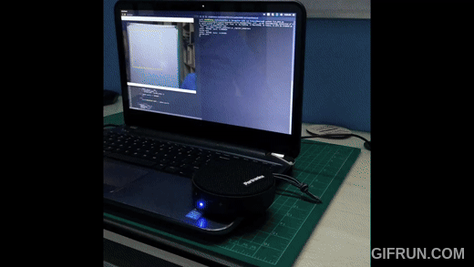

# ✋ Unvoiced: Sign Language to Speech Converter

Welcome to **Unvoiced**, an innovative application that translates American Sign Language (ASL) into speech! 🎤

## 🚀 Overview
Unvoiced leverages the power of transfer learning with an Inception V3 architecture to bring sign language to life through speech. You can explore the underlying model architecture on [GitHub](https://github.com/xuetsing/image-classification-tensorflow).

## 📋 Requirements
To get started, install the necessary dependencies by running the following command:

`sudo sh install_requirements.sh`

## Files
1. `old_model.py` A baseline CNN model that was tried. Scrapped because it didn't give good accuracy on real time test images. (Not used anymore)

2. `live_demo.py` prediction of the sign language alphabet that is shown by the speaker on live stream.

3. `query_classification.py` classification of a given test image.

## Dataset
The dataset used for this project was created by the owner of this repository. It is available on Kaggle as the [ASL Alphabet](https://www.kaggle.com/grassknoted/asl-alphabet) Dataset.
https://www.kaggle.com/grassknoted/asl-alphabet

#### query_classification.py
To run this file:
`python3 query_classification.py ./Test\ Images/<Letter>_test.jpg`

##### Example:

Running `python3 query_classification.py ./Test\ Images/L_test.jpg` will classify the image and predict the letter _L_.

### How it Works:
This script predicts the letter represented in the query image using a trained model stored in `trained_model_graph.pb`. It also utilizes `training_set_labels.txt` to maintain the training order. The prediction is then vocalized using Google's Text-to-Speech API. This classification method is also applied to the live stream model. 🎙️

#### live_demo.py

By default, it is works in real time. To change to _capture mode_ press `C`
In capture mode, classification is done on the region of interest only when `C` is pressed.

Pressing `R` goes back to real time mode.

Pressing `ESC` closes the live stream and exits the program.

---

We hope you enjoy using Unvoiced! If you have any questions or feedback, feel free to reach out. Happy signing! 🤟
